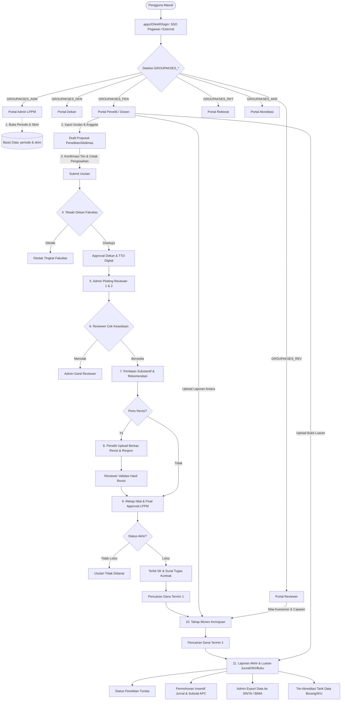

# Dokumentasi Alur Kerja (Workflow) Sistem SIPENAMAS

Dokumen ini memetakan seluruh alur kerja (*business process flow*), interaksi antar-modul, peran pengguna (*roles*), siklus hidup usulan (*proposal lifecycle*), serta referensi berkas backend pendukung di dalam sistem **SIPENAMAS** (Universitas Katolik Widya Mandala Surabaya).

---

## 1. Peta Modul & Matriks Peran Pengguna

Sistem SIPENAMAS diakses melalui portal SPA (ExtJS) pada direktori `appz/ONAIR/` yang dibagi berdasarkan 6 peran fungsional utama plus gerbang otentikasi:

```
appz/ONAIR/
├── login/       # Gerbang SSO Pegawai UKWMS & User Eksternal
├── pen/         # Modul Dosen Peneliti / Pelaksana Abdimas
├── dkn/         # Modul Dekan (Fakultas)
├── rev/         # Modul Reviewer (Penilaian Substansi & Monev)
├── adm/         # Modul Administrator LPPM (Manajemen Inti & SK/Pencairan)
├── rkt/         # Modul Rektorat (Approval Universitas, MBKM, & Dashboard)
└── akr/         # Modul Tim Akreditasi (Data Mining Borang & IKU)
```

### Matriks Tanggung Jawab & Hak Akses (RACI)

| Tahapan / Fitur | Peneliti (`pen`) | Dekan (`dkn`) | Reviewer (`rev`) | Admin LPPM (`adm`) | Rektorat (`rkt`) | Akreditasi (`akr`) |
| :--- | :---: | :---: | :---: | :---: | :---: | :---: |
| **Buka Periode & Pagu Anggaran** | - | - | - | **R** / **A** | **I** | - |
| **Pengajuan Proposal & Tim** | **R** / **A** | **I** | - | **I** | - | - |
| **Persetujuan Fakultas** | - | **R** / **A** | - | **I** | - | - |
| **Penetapan Reviewer** | - | - | - | **R** / **A** | - | - |
| **Penilaian Proposal & Revisi** | **C** (Revisi) | - | **R** / **A** | **I** | - | - |
| **Final Approval & Penetapan SK** | **I** | **I** | - | **R** / **A** | **A** (Riset Strategis) | - |
| **Pencairan Anggaran Termin** | **C** | **I** | - | **R** / **A** | **I** | - |
| **Monitoring & Evaluasi (Monev)** | **C** (Lapor) | **I** | **R** (Nilai) | **A** (Kelola) | **I** | - |
| **Laporan Akhir & Luaran** | **R** | **I** | **C** | **A** | **I** | **I** |
| **Subsidi APC & Insentif Jurnal** | **R** | **C** | - | **A** | **I** | **I** |
| **Pendaftaran HKI** | **R** | - | - | **A** | - | **I** |
| **Rekap Borang / IKU / SINTA** | - | **I** | - | **R** (SINTA) | **I** | **R** (Borang) |

*Keterangan: **R** = Responsible, **A** = Accountable/Approver, **C** = Consulted/Contributor, **I** = Informed.*

---

## 2. Diagram Alur Menyeluruh (End-to-End Lifecycle)



---

## 3. Rincian Alur Kerja Tiap Modul

### 3.1. Modul Gerbang Otentikasi (`login/`)

* **Tujuan**: Memverifikasi identitas sivitas akademika UKWMS dan mitra eksternal, lalu mengarahkan ke dashboard yang sesuai.
* **Alur Teknis**:
  1. `index.php` memuat form login bergaya modern.
  2. AJAX Request dikirim ke `appz/ONAIR/login/myphp/dologin.php`.
  3. Pengecekan awal ke tabel `person`:
     * Jika `ISEXTERNAL == 1`: Cocokkan username & password lokal (menggunakan fungsi dekripsi/enkripsi `encode3t()`).
     * Jika internal UKWMS: Jalankan `dologinpegawai_curl()` yang mengirimkan HTTP POST ke server SSO `https://api.ukwms.ac.id:8100/v1/auth/login`.
  4. Response SSO diparsing. Jika berhasil (`status == 200`), perbarui/buat baris personil di tabel `person`.
  5. Catat log login di tabel `z_log_login` (menyimpan IP via `get_client_ip()`, user agent, dan timestamp).
  6. Loop tabel `z_modulmodul` untuk menetapkan sesi otorisasi modul:
     * `$_SESSION['LPPM_LOGINCENTER_ISADM']`
     * `$_SESSION['LPPM_LOGINCENTER_ISPEN']`
     * `$_SESSION['LPPM_LOGINCENTER_ISREV']`
     * `$_SESSION['LPPM_LOGINCENTER_ISDKN']`
     * `$_SESSION['LPPM_LOGINCENTER_ISRKT']`
     * `$_SESSION['LPPM_LOGINCENTER_ISAKR']`
  7. Menentukan `$_SESSION['LPPM_HALAMANAKTIF']` pertama yang aktif, lalu redirect ke direktori modul tujuan.

---

### 3.2. Modul Peneliti / Pelaksana Abdimas (`pen/`)

* **Tujuan**: Workspace utama dosen untuk mengusulkan kegiatan tridharma, memantau tinjauan, mencairkan dana, dan mengunggah laporan luaran.
* **Alur Fitur**:
  1. **Dashboard (`dashboardpenelitian.php`, `dashboardabdimas.php`)**:
     * Ringkasan status usulan aktif, batas waktu submit, notifikasi revisi, dan status pencairan.
  2. **Pengajuan Proposal Baru (`permohonanpenelitian.php`, `permohonanabdimas.php`)**:
     * Mengisi form: Judul, Skim Penelitian/Abdimas, Bidang Keilmuan/Fokus, Sumber Dana, Usulan Anggaran per pos belanja.
     * Menambahkan Anggota Tim Dosen (`permohonanpenelitiantim.php`) dan Mahasiswa (`cmbmahasiswa.php`).
     * Anggota dosen wajib melakukan konfirmasi pada menu status kesediaan (`statuskesediaan.php`).
     * Mengunggah dokumen proposal PDF (`dokumenproposalpenelitian.php`).
     * Mencetak Lembar Pengesahan ber-watermark/QR (`permohonanpenelitian_pengesahan_pdf.php`).
  3. **Penanganan Revisi (`penilaianproposalrevisi.php`)**:
     * Mengunduh lembar evaluasi dan komentar dari reviewer.
     * Mengunggah dokumen revisi dan formulir tanggapan/matriks revisi.
  4. **Pelaksanaan & Pelaporan Kemajuan / Monev (`monevhasilpenelitian.php`)**:
     * Mengunggah laporan kemajuan dan log aktivitas harian/catatan lapangan.
     * Mengisi kuesioner monev capaian indikator kinerja penelitian (`kuesionerpenelitiandetail.php`).
  5. **Laporan Akhir & Rencana Target Hasil (`hasilpenelitian.php`, `rencanatargethasilpenelitian.php`)**:
     * Mengunggah Laporan Akhir lengkap, ringkasan eksekutif, dan poster/artikel.
  6. **Program Pendukung Publikasi & HKI**:
     * **Insentif Publikasi Jurnal (`insentivejurnal.php`)**: Klaim insentif artikel terbit (mengisi nama jurnal, indexasi Scopus/SINTA, URL artikel, lampiran PDF).
     * **Subsidi APC (`subsidiapc.php`)**: Pengajuan bantuan biaya publikasi Open Access bereputasi sebelum/sesudah *accepted*.
     * **Pendaftaran HKI (`hki.php`, `hkipeserta.php`)**: Pengajuan pencatatan ciptaan atau paten bersama LPPM.

---

### 3.3. Modul Dekan (`dkn/`)

* **Tujuan**: Penjaminan mutu usulan riset dan pengabdian di tingkat fakultas serta pengendalian anggaran fakultas.
* **Alur Fitur**:
  1. **Approval Proposal Masuk (`approvalpermohonan.php`, `approvalpenelitian.php`, `approvalabdimas.php`)**:
     * Dekan melihat semua proposal yang diajukan oleh dosen di bawah fakultasnya.
     * Mengecek kesesuaian RIP (Rencana Induk Penelitian) Fakultas, rekam jejak pengusul, dan batas pagu dana fakultas (`anggaranfakultas.php`, `anggaranprodi.php`).
     * Memberikan status: **Disetujui Fakultas** atau **Ditolak/Dikembalikan**.
     * Menghasilkan lembar pengesahan resmi ber-watermark persetujuan dekanat (`approvalpermohonan_pengesahan_docx.php`).
  2. **Approval Laporan Pelaksanaan (`approvallaporan.php`)**:
     * Verifikasi laporan hasil antara sebelum diajukan ke pencairan tahap berikutnya.
  3. **Monitoring Kinerja Fakultas (`daftarpenelitian.php`, `penelitianbelumtuntas.php`)**:
     * Memantau daftar dosen yang memiliki tanggungan riset/abdimas belum tuntas untuk peringatan internal.

---

### 3.4. Modul Reviewer (`rev/`)

* **Tujuan**: Penilaian objektif terhadap substansi kelayakan ilmiah usulan dan evaluasi kemajuan lapangan.
* **Alur Fitur**:
  1. **Konfirmasi Tugas Reviewer (`statuskesediaan.php`, `statuskesediaantim.php`)**:
     * Reviewer melihat daftar proposal yang di-assign oleh Admin LPPM.
     * Memilih opsi: **Bersedia Menilai** atau **Menolak** (misal karena konflik kepentingan/beban tugas).
  2. **Penilaian Proposal Substantif (`penilaianproposal.php`, `penilaianproposaldetail.php`)**:
     * Mengunduh naskah proposal terverifikasi.
     * Mengisi skor berdasarkan kriteria baku (metodologi, kebaruan, kualifikasi tim, kelayakan anggaran, target luaran).
     * Memasukkan komentar perbaikan dan rekomendasi keputusan:
       - *Diterima Tanpa Revisi*
       - *Diterima dengan Revisi*
       - *Ditolak*
     * Memberikan rekomendasi penyesuaian nominal dana yang disetujui.
  3. **Evaluasi Hasil Revisi (`penilaianproposalhasilrevisi.php`)**:
     * Memeriksa dokumen perbaikan dari peneliti dan respon tanggapannya.
     * Memberikan persetujuan final reviewer.
  4. **Monitoring & Evaluasi Lapangan (`kuesionerdetail_a.php`, `kuesionerdetail_b.php`)**:
     * Menilai kemajuan pelaksanaan, kendala di lapangan, serta persentase capaian luaran.

---

### 3.5. Modul Administrator LPPM (`adm/`)

* **Tujuan**: Pusat operasional seluruh kegiatan LPPM, pengelolaan dana, reviewer, SK, dan integrasi eksternal.
* **Alur Fitur**:
  1. **Pengaturan Master & Periode (`periode.php`, `periodegelombang.php`, `setting.php`)**:
     * Menentukan tahun anggaran, tanggal buka/tutup usulan, batas revisi, dan batas monev.
     * Menentukan skema riset (`skimpenelitian.php`), sumber pendanaan (`sumberdana.php`), dan kode mata anggaran (`tabelkodeanggaran.php`).
     * Menyusun rubrik kriteria penilaian proposal, poster, dan presentasi (`soalpenilaian*.php`).
  2. **Plotting & Penunjukan Reviewer (`setreviewer.php`, `setreviewerdetail.php`)**:
     * Memetakan usulan yang lolos verifikasi dekan ke 2 orang reviewer (Reviewer 1 & Reviewer 2) serta reviewer pembanding jika terjadi disparitas nilai ekstrem.
  3. **Rekapitulasi Nilai & Final Approval LPPM (`finalapproval.php`, `finalapprovalabdimas.php`)**:
     * Mengurutkan usulan berdasarkan *ranking* skor rata-rata reviewer.
     * Menetapkan status final: **LOLOS** atau **TIDAK LOLOS**.
     * Menentukan besaran dana definitif yang disetujui LPPM.
     * Men-generate nomor SK dan Surat Tugas Kontrak Riset (`surattugas_*.docx`).
  4. **Pengelolaan Pencairan Dana (`penggunaananggaranpenelitian.php`)**:
     * Validasi kuitansi dan SPJ pengeluaran dana tahap 1 dan tahap 2.
  5. **Pengelolaan Insentif Jurnal & Subsidi APC (`insentivejurnal.php`, `subsidiapc.php`)**:
     * Verifikasi bukti korespondensi, kevalidan indexing Scopus/SINTA, approval pembayaran reimbursement ke rekening dosen.
  6. **Pelaporan Nasional & Ekspor SINTA (`finalapproval_sinta_xls.php`, `kegiatanabdimas_sinta_xls.php`)**:
     * Menghasilkan file Excel terstandarisasi untuk diimpor ke sistem SINTA Kemendikbudristek.
  7. **Notifikasi WhatsApp Massal (`waqrcode.php`, `watest.php`, `logwappin.php`)**:
     * Pengendalian gateway WhatsApp untuk notifikasi pengumuman lolos, pengingat deadline revisi, dan pengingat monev.

---

### 3.6. Modul Rektorat (`rkt/`)

* **Tujuan**: Pengawasan eksekutif pimpinan universitas terhadap produktivitas riset dan keterkaitan dengan program MBKM.
* **Alur Fitur**:
  1. **Executive Dashboard & Chart (`dosen_barchart.php`, `mahasiswa_barchart.php`, `tendik_barchart.php`)**:
     * Grafik batang & pie chart sebaran penelitian per fakultas, rasio keterlibatan mahasiswa, dan serapan total dana internal/eksternal.
  2. **Approval Strategis Universitas (`approvalpermohonan.php`, `approvalpenelitian.php`)**:
     * Persetujuan usulan penelitian unggulan universitas atau riset kolaborasi strategis dengan nilai anggaran khusus.
  3. **Monitoring MBKM Riset (`mbkm.php`, `mbkmbyprodi.php`, `mbkmdatahasilmahasiswa.php`)**:
     * Memverifikasi konversi mata kuliah / SKS bagi mahasiswa yang magang penelitian pada proyek dosen pembimbing.

---

### 3.7. Modul Akreditasi (`akr/`)

* **Tujuan**: Penarikan data agregat dan bukti portofolio untuk pemenuhan Indikator Kinerja Utama (IKU) dan instrumen akreditasi prodi (LAM/BAN-PT).
* **Alur Fitur**:
  1. **Ekstraksi Data Penelitian & Abdimas (`daftarpenelitian.php`, `daftarabdimas.php`)**:
     * Filter data spesifik berdasarkan Program Studi, Tahun Akademik, dan Jenjang Strata.
  2. **Data Luaran Publikasi & HKI (`insentivejurnal.php`, `hki.php`, `subsidiapc.php`)**:
     * Menghitung produktivitas publikasi artikel jurnal internasional bereputasi, jurnal nasional terakreditasi, dan sertifikat HKI/Paten.
  3. **Ekspor Tabel Borang (`*_xls.php`)**:
     * Mengunduh data siap pakai dalam format Excel untuk tabel LKPS (Laporan Kinerja Program Studi).

---

## 4. Transisi Status Usulan (State Machine)

Status usulan pada tabel `penelitian` dan `kegiatanabdimas` bergerak melalui tahapan berurutan:

```
[ DRAFT ]
   │
   ▼
[ SUBMITTED / MENUNGGU PERSETUJUAN DEKAN ]
   │
   ├── (Ditolak Dekan) ──────────────► [ DITOLAK FAKULTAS ]
   │
   ▼ (Disetujui Dekan)
[ PLOTTED / MENUNGGU REVIEWER ]
   │
   ▼
[ DALAM PENILAIAN REVIEWER ]
   │
   ├── (Perlu Perbaikan) ─────────────► [ REVISI PROPOSAL ] ──► (Upload Ulang) ─┐
   │                                                                            │
   ▼                                                                            │
[ SELESAI REVIEW ] ◄────────────────────────────────────────────────────────────┘
   │
   ▼
[ FINAL APPROVAL LPPM ]
   │
   ├── (Tidak Lolos Seleksi) ─────────► [ TIDAK LOLOS ]
   │
   ▼ (Lolos Seleksi & Terbit SK)
[ KONTRAK / LOLOS PENDANAAN ]
   │
   ▼
[ PENCAIRAN TAHAP 1 ]
   │
   ▼
[ PROSES MONEV LAPANGAN ]
   │
   ▼
[ PENCAIRAN TAHAP 2 ]
   │
   ▼
[ UNGGAH LAPORAN AKHIR & LUARAN ]
   │
   ▼
[ SELESAI & TUNTAS ]
```

---

## 5. Indeks File Backend Utama Berdasarkan Modul

Berikut daftar berkas PHP handler utama di `appz/ONAIR/` beserta fungsinya:

| Modul | File Script Backend | Fungsi Utama |
| :--- | :--- | :--- |
| **Global** | `appz/posko/myfunctions.php` | Library umum: fungsi cURL SSO, watermarking, manipulasi gambar, enkripsi sesi. |
| **Global** | `appz/posko/myorm.php` | Koneksi database `dbsipenamas` via Idiorm ORM. |
| **Login** | `login/myphp/dologin.php` | Autentikasi SSO pegawai UKWMS dan otorisasi modul per role. |
| **Peneliti** | `pen/myphp/permohonanpenelitian.php` | CRUD usulan penelitian dosen & form input data riset. |
| **Peneliti** | `pen/myphp/permohonanpenelitiantim.php` | Manajemen dosen anggota dan peran (ketua/anggota). |
| **Peneliti** | `pen/myphp/dokumenproposalpenelitian.php` | Upload berkas proposal PDF dan lampiran pendukung. |
| **Peneliti** | `pen/myphp/monevhasilpenelitian.php` | Upload dokumen laporan kemajuan untuk penilaian monev. |
| **Peneliti** | `pen/myphp/hasilpenelitian.php` | Upload dokumen laporan akhir & bukti capaian luaran. |
| **Peneliti** | `pen/myphp/insentivejurnal.php` | Formulir pengajuan insentif publikasi artikel ilmiah. |
| **Peneliti** | `pen/myphp/subsidiapc.php` | Formulir pengajuan subsidi APC (*Article Processing Charge*). |
| **Reviewer** | `rev/myphp/statuskesediaan.php` | Konfirmasi kesediaan penugasan reviewer oleh dosen penilai. |
| **Reviewer** | `rev/myphp/penilaianproposal.php` | Input skor kriteria penilaian substantif dan rekomendasi dana. |
| **Reviewer** | `rev/myphp/penilaianproposalhasilrevisi.php`| Validasi naskah revisi yang dikirimkan oleh dosen peneliti. |
| **Dekan** | `dkn/myphp/approvalpermohonan.php` | Daftar persetujuan proposal di level fakultas. |
| **Dekan** | `dkn/myphp/anggaranfakultas.php` | Kontrol pagu dan alokasi anggaran penelitian fakultas. |
| **Admin** | `adm/myphp/periode.php` | Manajemen periode pengusulan, tahun anggaran, dan gelombang. |
| **Admin** | `adm/myphp/setreviewer.php` | Penugasan reviewer 1 dan reviewer 2 untuk setiap proposal. |
| **Admin** | `adm/myphp/finalapproval.php` | Penetapan status kelulusan usulan dan alokasi dana definitif. |
| **Admin** | `adm/myphp/penggunaananggaranpenelitian.php`| Validasi pencairan dana termin 1 dan termin 2 beserta SPJ. |
| **Admin** | `adm/myphp/finalapproval_sinta_xls.php` | Export spreadsheet kompatibel untuk sinkronisasi ke SINTA. |
| **Rektorat** | `rkt/myphp/dosen_barchart.php` | Visualisasi grafik batang partisipasi riset dosen per unit. |
| **Rektorat** | `rkt/myphp/mbkm.php` | Rekapitulasi keterlibatan mahasiswa dalam riset skema MBKM. |
| **Akreditasi** | `akr/myphp/daftarpenelitian.php` | Ekstraksi rekap data portofolio riset per program studi. |
| **Akreditasi** | `akr/myphp/hki.php` | Rekap data perolehan HKI dan paten untuk borang akreditasi. |
| **Background** | `appz/decron/cron_watzap.php` | Cron job pengiriman pesan WhatsApp otomatis terjadwal. |
